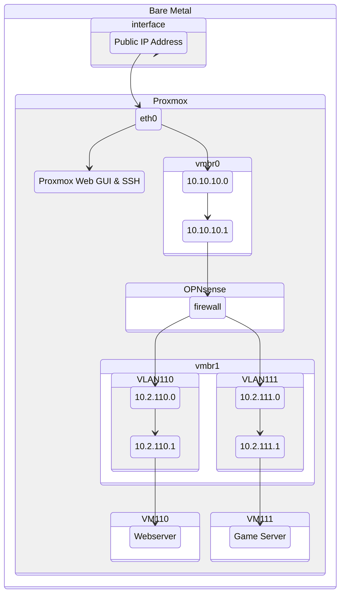

# Download and verification
Download [OPNsense](https://opnsense.org/download/) and upload to Proxmox.

> [!note]
> You should always [verify the Checksum](https://docs.opnsense.org/manual/install.html#download-and-verification) to determine the Authenticity of your image

# Creating VM in Proxmox
Choose your desired Node, Name, ID and Resource Pool.
Under Advanced check Start at boot.

On the OS tab choose `Use CD/DVD disc image file (iso)` and attach the iso, that you uploaded earlier

Leave System as default (unless you know what you're doing)

Under the Disks tab set the Disk size to at least 40GiB, but rather 50GiB. Check the ``IO thread`` box (might be under advanced) to fasten up read and write speed a little.

Next up, set 3 or more CPU Cores and enable ``aes`` under the advanced options. You might configure CPU Sockets, read more here.

Memory we will set to 8192 MiB. You might be fine with less, but it might very well be a bottleneck.

Check `No Network Device` and finish the creation process.
# Networking

## Proxmox Bridges
We'll need two different bridges:
- Linux Bridge (vmbr0) for Proxmox and OPNsense
- OVS Bridge (vmbr1) for OPNsense and VMs



#### OVS Bridge
Under `/etc/network/interfaces` on our Proxmox host, configure it so that its matching this: 

```vim
auto eth0
iface eth0 inet static
	address <PUBLIC IP>/netmask
	gateway <PUBLIC IP>
	up route add -net <PUBLIC IP> netmask 255.255.255.224 gw <PUBLIC IP> dev enp41s0
	post-up sysctl -w net.ipv4.ip_forward=1
	post-up iptables -t nat -A PREROUTING -i eth0 -p tcp -m multiport ! --dport 22,8006 -j DNAT --to 10.10.10.1
	post-up iptables -t nat -A PREROUTING -i eth0 -p udp -j DNAT --to 10.10.10.1


auto vmbr0
iface vmbr0 inet static
	address 10.10.10.0/31
	bridge-ports none
	bridge-stp off
	bridge-fd 0
	post-up iptables -t nat -A POSTROUTING -s '10.10.10.1/31' -o eth0 -j MASQUERADE
	post-down iptables -t nat -D POSTROUTING -s '10.10.10.1/31' -o eth0 -j MASQUERADE
# WAN OPNsense and Proxmox lan

auto vmbr1
iface vmbr1 inet manual
	ovs_type OVSBridge
# VM Network
```